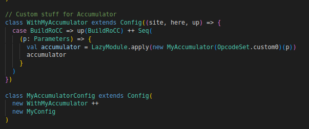

# Unofficial Chipyard Resources for MDC ELEN90093

This applies to Chipyard version 1.8.1, although should *probably* remain valid for 1.9 and onwards.  

Abridged Changelog:
- June 2023: First version
- May 2024: Minor Changes 
- June 2024: Moved to Github. Originally on [Notion](https://depf.notion.site/Chipyard-Resources-for-MDC-ELEN90093-e88cb4824c9145c5ad3ba3a54e29b6d3).

Original Context: 32x32 sized matrix multiplication (32 bit floating point) accelerator

## Useful Resources and Advice

- General places to look:
    - Stackoverflow chipyard
    - [Chipyard Google Groups](https://groups.google.com/g/chipyard)
    - [Rocketchip Github Issues](https://github.com/chipsalliance/rocket-chip/issues)
    - [Chipyard Github Issues](https://github.com/ucb-bar/chipyard/issues)
    - [https://blog.csdn.net/a_weiming?type=blog](https://blog.csdn.net/a_weiming?type=blog) (in Chinese)
- Firstly, there is **NO WAY** to print floats. Can only print longs, ints etc when using spike or the `run-binary` thing. See comments [here](https://github.com/ucb-bar/chipyard/blob/main/tests/fft.c) mentioning this (pasted below).
    
    ```jsx
        /* To convert binary to floating point
         * However, RISC-V compiler can't print floats. You can use this by copy-pasting it into an online
         * C compiler. 
    ```
    
- Initial tests with scala/chisel3
    - For simple modules, like getting floating point multipliers etc, best to just use `sbt` (scala build tool) to compile and test scala/chisel3 stuff, rather than wasting time compiling chipyard/rocketchip stuff
    - Check out this https://github.com/freechipsproject/chisel-template
- About L1 cache:
    - [https://stackoverflow.com/questions/58847575/loading-and-storing-into-l1-cache-of-rocket-chip](https://stackoverflow.com/questions/58847575/loading-and-storing-into-l1-cache-of-rocket-chip)
    - [https://stackoverflow.com/questions/30744328/how-do-memreq-and-memresp-exactly-work-in-roccio-riscv/30794843#30794843](https://stackoverflow.com/questions/30744328/how-do-memreq-and-memresp-exactly-work-in-roccio-riscv/30794843#30794843)
    - [NBDcache.scala](https://github.com/chipsalliance/rocket-chip/blob/master/src/main/scala/rocket/NBDcache.scala)
    - `ready` and `valid` on a ready-valid interface go in opposite directions. As the requestor,
     you specify when the request is "valid", but it is the receiver's 
    responsibility to determine when they are "ready" to receive your 
    request. Basically, the other side of the interface is driving `ready`, and you can only consider the request accepted when both `valid` (driven by you), and `ready` (driven by them) are asserted in the same cycle.
        - particularly this is important for stuff like:
            - `io.resp.valid`
            - `io.mem.req.valid` and `io.mem.resp.valid`
            - `cmd.ready` (assuming `cmd = Queue(io.cmd)` , note this `cmd` does not work exactly the same as `io.cmd`)
    - Similar to Accumulator example from LazyRocc.scala (and workshops), `io.mem.req` can access global variables (both store and load)
    - Although much more complex, can check the sha3 scala code for more info example on how to store and load data from L1 cache (and also follows FSM form with states etc)
        - [https://github.com/ucb-bar/sha3/blob/master/src/main/scala/ctrl.scala](https://github.com/ucb-bar/sha3/blob/master/src/main/scala/ctrl.scala)
- About the Assertion failed error when simulating/running the binary
    - Error looks similar to `%Error: chipyard.TestHarness..top.v:207759 Assertion failed...`
    - Follow the instructions in link below to confirm if issue is the same (go check the verilog .v file and go to the line number)
    - [https://groups.google.com/g/chipyard/c/OIbByFj6cZ0/m/Mo2PUuUOAwAJ](https://groups.google.com/g/chipyard/c/OIbByFj6cZ0/m/Mo2PUuUOAwAJ)
        - Usually get this error `“$fatal; // @[SimpleHellaCacheIF.scala 135:9]”` on line 208782 on the top.v
        - Likely valid request to inaccessible memory
        - Possibly also due to wrong size of mem.req, check the link under the section titled "*Somehow writing ZEROS...*"
- Getting waveforms (.vcd files)
    - https://github.com/chipsalliance/rocket-chip/issues/2955 Check this Github issue on chipyard for more info
    - **NOTE:** the VCD file (waveform file) can be very big in size (like 7 Gigs +  or even 12-ish depending on complexity of C test file)
    - I use the following to compile the chipyard project: `make debug CONFIG=MyMatMulConfig run-binary-debug BINARY=~/chipyard/example-tests/matmul/accel_matmul.riscv`
        - Change CONFIG and BINARY to whatever your config name is and wherever your compiled C test file is.
        - This creates a file in `chipyard/sims/verilator` called `simulator-chipyard-MyMatMulConfig-debug` , note the additional “-debug” at the end.
        - Go to `chipyard/sims/verilator/output/MyMatMulConfig/` folder and you should find a **.vcd file** which you can open up with software like [GTKWave](https://github.com/gtkwave/gtkwave)
        - The important signals you have in your RoCC accelerator will be in:
        TOP > TestHarness > chiptop > system > tile_prci_domain > tile_reset_domain > tile > **VARNAME_HERE**
        - VARNAME_HERE would be what you named your BuildRocc thing. Most likely you can find in TutorialConfigs.scala . For example, this could be called `accumulator` for the code below:
        
        
        

- For how to do FSM style of coding (using states, eg: `s_resp` etc) in Scala/Chisel3 , check [LazyRocc.scala](https://github.com/chipsalliance/rocket-chip/blob/master/src/main/scala/tile/LazyRoCC.scala) , the examples below the accumulator example follow FSM styles.
- Somehow writing ZEROS to adjacent columns for a matrix? Weird interaction when writing 32bit data to L1 cache. Memory alignment issues.
    - Firstly, if writing 32bit data to L1 cache, need to change `io.mem.req.bits.size`
        - see [https://stackoverflow.com/questions/59728331/32-bit-hella-cache-access-for-coprocessor-acculator-example](https://stackoverflow.com/questions/59728331/32-bit-hella-cache-access-for-coprocessor-acculator-example)
        - Since the Accumulator example writes 64 bits, it is set to log2ceil(8). set to log2ceil(4) if writing 32 bits
    - `io.mem.req.bits.data` is a 64 bit signal line (probably because Rocketchip is 64 bits)
    - Even after this, you should set `io.mem.req.bits.data := Cat(value(31,0), value(31,0))` . Basically meaning top 32 bits and bottom 32 bits are exactly the same 32 bit value
    - If you don’t do this while writing to L1 memory, I found that for a matrix, column 0,2,4… writes the correct value, but columns 1,3,5… are written with 0s.
    - If this doesn’t make sense just ignore.